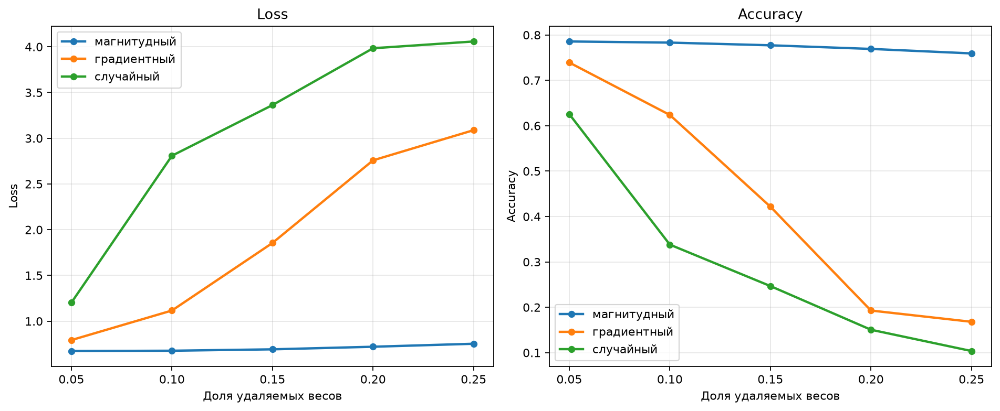
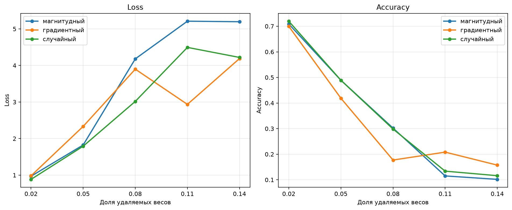

# Прунинг моделей на примере ResNet18

В работе рассмотрены 4 метода:
1. магнитудный неструктурированный (mu)
2. магнитудный структурный (ms)
3. градиентный неструктурированный (gu)
4. градиентный структурный (gs)

Проведено сравнение со случайным удалением весов (ru)/каналов (rs) и
измерены метрики loss и accuracy для различных долей удаляемых весов/каналов

## Неструктурированные

| метод | доля удаляемых весов | loss | accuracy |
|-------|----------------------|------|----------|
| магнитудный | 0.05 | 0.6737 | 0.7856 |
| магнитудный | 0.10 | 0.6769 | 0.7832 |
| магнитудный | 0.15 | 0.6922 | 0.7773 |
| магнитудный | 0.20 | 0.7205 | 0.7693 |
| магнитудный | 0.25 | 0.7531 | 0.7594 |
| градиентный | 0.05 | 0.7933 | 0.7393 |
| градиентный | 0.10 | 1.1166 | 0.6238 |
| градиентный | 0.15 | 1.8554 | 0.4217 |
| градиентный | 0.20 | 2.7584 | 0.1929 |
| градиентный | 0.25 | 3.0882 | 0.1681 |
| случайный | 0.05 | 1.2032 | 0.6256 |
| случайный | 0.10 | 2.8087 | 0.3381 |
| случайный | 0.15 | 3.3627 | 0.2468 |
| случайный | 0.20 | 3.9838 | 0.1506 |
| случайный | 0.25 | 4.0579 | 0.1037 |

## Структурные

| метод | доля удаляемых каналов | loss | accuracy |
|-------|------------------------|------|----------|
| магнитудный | 0.02 | 0.9707 | 0.7088 |
| магнитудный | 0.05 | 1.8246 | 0.4890 |
| магнитудный | 0.08 | 4.1802 | 0.3021 |
| магнитудный | 0.11 | 5.2109 | 0.1152 |
| магнитудный | 0.14 | 5.1962 | 0.1018 |
| градиентный | 0.02 | 0.9820 | 0.6997 |
| градиентный | 0.05 | 2.3330 | 0.4186 |
| градиентный | 0.08 | 3.8991 | 0.1772 |
| градиентный | 0.11 | 2.9361 | 0.2082 |
| градиентный | 0.14 | 4.1894 | 0.1574 |
| случайный | 0.02 | 0.8852 | 0.7197 |
| случайный | 0.05 | 1.7918 | 0.4889 |
| случайный | 0.08 | 3.0172 | 0.2984 |
| случайный | 0.11 | 4.4945 | 0.1339 |
| случайный | 0.14 | 4.2196 | 0.1161 |

